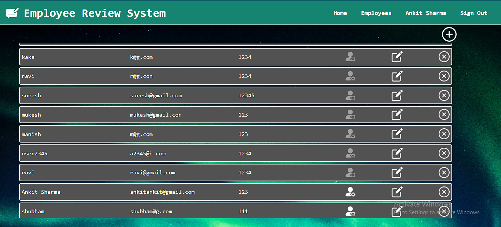

# Employee Review System App

This is a web application for managing employee reviews. It allows administrators to assign and review feedback for employees. Employees can view their assigned reviews and submit their feedback.

## Features

- **User Management**: Administrators can view, create, update, and delete user accounts. Users can be assigned as administrators or regular employees.

- **Review Assignment**: Administrators can assign reviews to employees. Pending reviews are displayed in a list, and employees can view their assigned reviews.

- **Review Submission**: Employees can submit feedback for their assigned reviews.

- **Review Expansion**: Users can expand a review to view its details and feedback.

## Technologies Used

- Frontend: HTML, CSS, JavaScript, jQuery
- Backend: Node.js, Express.js
- Database: MongoDB

## Getting Started

1. Clone the repository: `git clone https://github.com/KKBhati07/Employee-Review-System.git`
2. Install the dependencies: `npm install`
3. Start the server: `node index.js`
4. Open the application in your web browser: `http://localhost:3200`

## Backend Directory Structure

- **Controllers**: Contains controller functions to handle HTTP requests.
- **Models**: Contains database models for users and reviews.
- **Routes**: Contains routes for handling requests.
- **views**: Contains view templates for rendering dynamic HTML pages.

## How to Use the App

1. Login as an admin to access the admin home page.
2. View the list of users and their details.
3. Edit user details, toggle admin status, or delete users.
4. Assign reviews to employees from the admin home page.
5. The assigned reviews will be displayed on the employee home page.
6. Employees can view details and provide feedback.

## Screenshots

